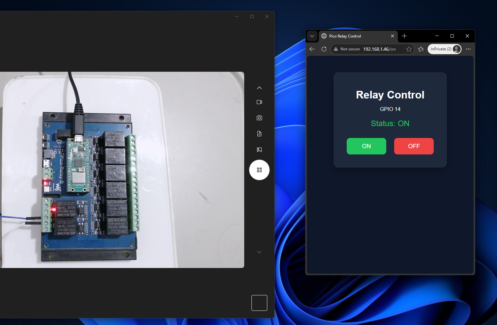

# 🔌 Pico IoT Server

โปรเจคควบคุม Relay ผ่าน WiFi ด้วย **Raspberry Pi Pico W** รองรับทั้งการควบคุมผ่าน **Web Browser** และ **TCP Socket Client** จาก PC

---

## 📷 ตัวอย่างการใช้งาน

> บอร์ด Waveshare Pico-Relay-B เชื่อมต่อ WiFi และแสดงหน้า Web UI สำหรับควบคุม Relay GPIO 14

---

## 🗂️ โครงสร้างไฟล์

```
pico-iot-server/
├── connect_wifi.py      # ทดสอบการเชื่อมต่อ WiFi
├── turnon_relay.py      # TCP Socket Server สำหรับควบคุม Relay
├── webserver.py         # Web Server ควบคุม Relay ผ่าน Browser
└── pc_client.py         # TCP Client สำหรับส่งคำสั่งจาก PC
```

---

## ⚙️ อุปกรณ์ที่ใช้

| อุปกรณ์ | รายละเอียด |
|---|---|
| **Raspberry Pi Pico W** | ไมโครคอนโทรลเลอร์ที่มี WiFi ในตัว |
| **Waveshare Pico-Relay-B** | บอร์ด Relay 8 ช่อง สำหรับ Pico |
| **WiFi Router** | เครือข่ายท้องถิ่น (LAN) |

---

## 📡 1. `connect_wifi.py` — ทดสอบการเชื่อมต่อ WiFi

ไฟล์นี้ใช้สำหรับ **ทดสอบว่า Pico W สามารถเชื่อมต่อ WiFi ได้หรือไม่** ก่อนนำไปใช้กับโปรเจคจริง

### การทำงาน

1. สร้าง WLAN interface แบบ Station Mode (`STA_IF`)
2. เรียก `wlan.connect(ssid, password)` เพื่อเชื่อมต่อ
3. รอจนกว่าจะเชื่อมต่อสำเร็จ หรือหมด Timeout 10 วินาที
4. แสดง IP Address ที่ได้รับจาก Router

```python
wlan = network.WLAN(network.STA_IF)
wlan.active(True)
wlan.connect(ssid, password)
```

### ผลลัพธ์เมื่อสำเร็จ
```
Connecting to WiFi.....
Connected!
IP address: 192.168.1.46
```

> **💡 หมายเหตุ:** ต้องเปลี่ยน `ssid` และ `password` ให้ตรงกับ WiFi ของคุณก่อนใช้งาน

---

## 🔁 2. `turnon_relay.py` — TCP Socket Server บน Pico W

ไฟล์นี้รันบน Pico W เพื่อเปิด **Socket Server** รอรับคำสั่งจาก PC หรืออุปกรณ์อื่นในเครือข่าย

### การทำงาน

```
PC / Client  ──[TCP:5000]──►  Pico W Socket Server  ──►  Relay GPIO14
```

1. **เชื่อมต่อ WiFi** และรับ IP Address
2. **ตั้งค่า GPIO 14** เป็น Output สำหรับควบคุม Relay (เริ่มต้น OFF)
3. **เปิด Socket Server** บน Port `5000` รอรับการเชื่อมต่อ
4. **รับคำสั่ง** จาก Client แล้วตอบสนอง:

| คำสั่ง | การทำงาน | การตอบกลับ |
|---|---|---|
| `RL14-ON` | เปิด Relay (GPIO14 = HIGH) | `Relay ON` |
| `RL14-OFF` | ปิด Relay (GPIO14 = LOW) | `Relay OFF` |
| อื่นๆ | ไม่รู้จักคำสั่ง | `Unknown command` |

```python
relay = Pin(14, Pin.OUT)

if cmd == "RL14-ON":
    relay.value(1)
    client.send("Relay ON\n")
elif cmd == "RL14-OFF":
    relay.value(0)
    client.send("Relay OFF\n")
```

> **🔒 หมายเหตุ:** รองรับ Client ทีละ 1 คนต่อครั้ง เมื่อ Client ตัดการเชื่อมต่อ Server จะวนกลับไปรอ Client ใหม่

---

## 🌐 3. `webserver.py` — Web Server ควบคุมผ่าน Browser

ไฟล์นี้รันบน Pico W เพื่อเปิด **HTTP Web Server** ให้ผู้ใช้ควบคุม Relay ผ่านหน้าเว็บได้โดยตรง

### การทำงาน

```
Browser  ──[HTTP:80]──►  Pico W Web Server  ──►  Relay GPIO14
```

1. **เชื่อมต่อ WiFi** และเปิด Server บน Port `80`
2. **รับ HTTP Request** จาก Browser
3. **ตรวจสอบ URL Path:**

| URL | การทำงาน |
|---|---|
| `http://<IP>/on` | เปิด Relay |
| `http://<IP>/off` | ปิด Relay |
| `http://<IP>/` | แสดงหน้าหลัก (สถานะปัจจุบัน) |

4. **ส่งหน้า HTML** กลับไปแสดงผลใน Browser พร้อมสถานะปัจจุบัน

### หน้า Web UI
- แสดงสถานะ **ON** (สีเขียว) / **OFF** (สีแดง)
- มีปุ่ม ON / OFF สำหรับควบคุม
- ออกแบบ Responsive รองรับมือถือ

```python
def render_page(state):
    status_text = "ON" if state else "OFF"
    status_color = "#22c55e" if state else "#ef4444"
    # ส่ง HTML กลับพร้อมสถานะล่าสุด
```

> **🌐 วิธีใช้:** เปิด Browser แล้วพิมพ์ `http://192.168.1.46` (ใช้ IP ที่ Pico แสดง)

---

## 💻 4. `pc_client.py` — TCP Client สำหรับ PC

ไฟล์นี้รันบน **PC** (Windows/Linux/Mac) เพื่อส่งคำสั่งไปยัง Pico W ผ่าน TCP Socket

### การทำงาน

1. เชื่อมต่อไปยัง IP ของ Pico W บน Port `5000`
2. ส่งคำสั่ง `RL14-ON` หรือ `RL14-OFF`
3. รับและแสดงผลการตอบกลับ
4. ปิดการเชื่อมต่อ

```python
pico_ip = "192.168.1.46"  # เปลี่ยนเป็น IP ของ Pico W
port = 5000

s = socket.socket()
s.connect((pico_ip, port))
s.send(b"RL14-OFF")
print(s.recv(1024))
s.close()
```

> **⚠️ ต้องรัน `turnon_relay.py` บน Pico W ก่อน** จึงจะใช้ `pc_client.py` ได้

---

## 🚀 วิธีติดตั้งและใช้งาน

### ขั้นตอนที่ 1 — ตั้งค่า WiFi

แก้ไขค่า `ssid` และ `password` ในทุกไฟล์:

```python
ssid = 'YOUR_WIFI_NAME'       # ชื่อ WiFi ของคุณ
password = 'YOUR_WIFI_PASSWORD'  # รหัสผ่าน WiFi
```

### ขั้นตอนที่ 2 — อัปโหลดไฟล์ไปยัง Pico W

ใช้ **Thonny IDE** หรือ `mpremote` เพื่ออัปโหลดไฟล์:

```bash
# ติดตั้ง mpremote
pip install mpremote

# อัปโหลดไฟล์
mpremote cp webserver.py :main.py
```

### ขั้นตอนที่ 3 — เลือกโหมดการใช้งาน

| โหมด | ไฟล์ที่อัปโหลด | วิธีควบคุม |
|---|---|---|
| **Web Browser** | `webserver.py` → `main.py` | เปิด Browser ไปที่ IP ของ Pico |
| **TCP Socket** | `turnon_relay.py` → `main.py` | รัน `pc_client.py` บน PC |

### ขั้นตอนที่ 4 — ค้นหา IP Address

รัน `connect_wifi.py` ก่อนเพื่อดู IP ที่ได้รับ แล้วนำไปอัปเดตใน `pc_client.py`:

```python
pico_ip = "192.168.1.46"  # เปลี่ยนเป็น IP จริงของ Pico W
```

---

## 🔄 สรุปความแตกต่างระหว่าง 2 โหมด

| คุณสมบัติ | `webserver.py` | `turnon_relay.py` |
|---|---|---|
| **Protocol** | HTTP (Port 80) | TCP Socket (Port 5000) |
| **Client** | Web Browser | Python Script / โปรแกรม |
| **Interface** | หน้า HTML กราฟิก | Command-based |
| **เหมาะกับ** | ใช้งานทั่วไป / มือถือ | Integration / Automation |

---

## 📝 License

MIT License — ใช้งานได้อย่างอิสระสำหรับโปรเจคส่วนตัวและเชิงพาณิชย์
